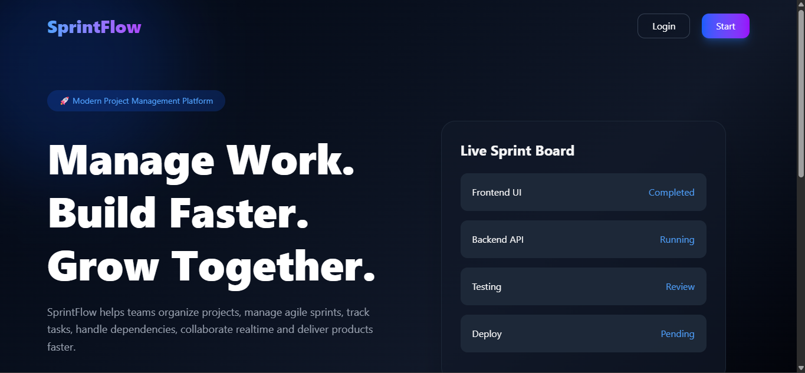
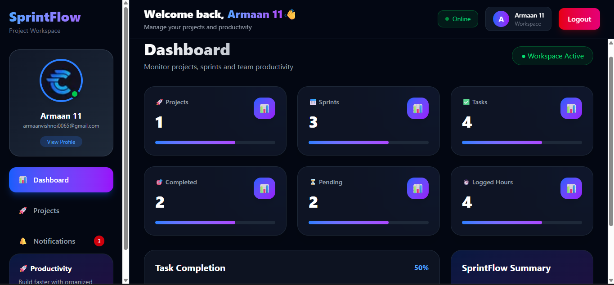
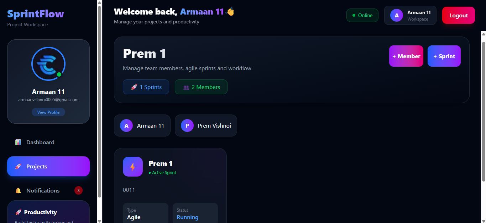
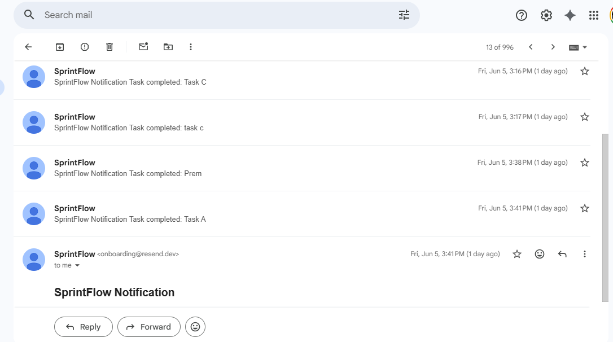

# 🚀 SprintFlow - Agile Project Management System

SprintFlow is a full-stack real-time project management application built for managing software development workflows.  
It provides projects, sprints, tasks, collaboration, notifications, file management, time tracking, and team productivity features.

---

## 🌐 Live Demo

Frontend:
```
(https://sprintflow-plum.vercel.app/)
```

Backend:
```
(https://sprintflow-backend-llur.onrender.com/)
```

---

# 📸 Project Screenshots

## Landing Page


## Dashboard


## Project Management


## Sprint Board


## Real-Time Notifications


## Email Notification


---

# ✨ Features

## 🔐 Authentication System

- User Registration
- Secure Login
- JWT Authentication
- Protected Routes
- Persistent Sessions
- Logout System


---

# 👤 User Profile Management

Users can:

- Update profile details
- Upload profile image
- Change password
- Enable / Disable email notifications
- Deactivate account


---

# 🚀 Project Management

Users can:

- Create projects
- Update projects
- Delete projects
- Manage project members
- View project workspace


---

# 🏃 Sprint Management

Supports agile sprint workflow:

- Create sprint
- Update sprint details
- Delete sprint
- Sprint based task organization


---

# ✅ Task Management System

Complete Kanban workflow:

### Task Status

- TODO
- IN PROGRESS
- DONE


Features:

- Create tasks
- Assign members
- Update status
- Delete tasks
- Task dependencies
- Subtasks support
- Task validation


---

# ⚡ Real-Time Collaboration

Implemented using Socket.IO.

Features:

- Live task creation updates
- Live task status updates
- Active project rooms
- Real-time notification updates
- Multiple browser synchronization


Example:

User A creates a task → User B instantly receives update without refreshing.


---

# 🔔 Notification System

Complete notification module:

- Real-time notifications
- Unread notification count
- Read notification
- Mark all as read
- Delete notifications
- Clear notifications


---

# 📧 Email Notification System

Email delivery implemented using Resend API.

Users can enable email notifications.

Email events:

- New task assigned
- Task completed
- Important updates


Note:

Resend free mode requires sender/domain verification for unrestricted external email delivery.


---

# ⏱ Time Tracking / Work Logs

Users can:

- Add work logs
- Track task hours
- Update logged time
- Delete work logs

Automatic calculation of task progress.


---

# 📎 Attachments

Task attachment support:

- Upload files
- Store attachments
- Delete attachments


---

# 💬 Comments System

Task discussions:

- Add comments
- View discussions
- Collaboration support


---

# 📊 Dashboard

Dashboard includes:

- Project statistics
- Task overview
- Sprint progress
- Productivity information


---

# 🛠 Tech Stack


## Frontend

- React
- TypeScript
- Tailwind CSS
- React Router
- Axios
- Socket.IO Client


---

## Backend

- Node.js
- Express.js
- TypeScript
- MongoDB
- Mongoose
- Socket.IO
- JWT Authentication
- Resend Email API


---

## Database

MongoDB Atlas

Collections:

- Users
- Projects
- Sprints
- Tasks
- Notifications
- Comments
- Attachments
- Work Logs


---

# 🏗 Architecture


Frontend (React)

↓

REST API (Express)

↓

MongoDB Atlas


Realtime:

React Client

↓

Socket.IO

↓

Express Server


---

# 🔒 Security Features

- Password hashing
- JWT authorization
- Protected APIs
- Environment variables
- User based data access
- Input validation


---

# ⚙️ Installation


Clone repository

```bash
git clone YOUR_REPOSITORY_URL
```

Install frontend

```bash
cd frontend

npm install

npm run dev
```

Install backend

```bash
cd backend

npm install

npm run dev
```

---

# 🔑 Environment Variables


Backend `.env`

```env
PORT=5000

MONGO_URI=your_mongodb_url

JWT_SECRET=your_secret

RESEND_API_KEY=your_resend_key
```


Frontend `.env`

```env
VITE_API_URL=backend_url
```

---

# 🚀 Deployment


Frontend:

Vercel


Backend:

Render


Database:

MongoDB Atlas


---

# Future Improvements

- AI sprint planning
- Analytics dashboard
- Team chat
- Calendar integration
- Mobile application


---

# Author

Developed by **Prem Vishnoi**

Full Stack Developer | AI/ML Enthusiast
